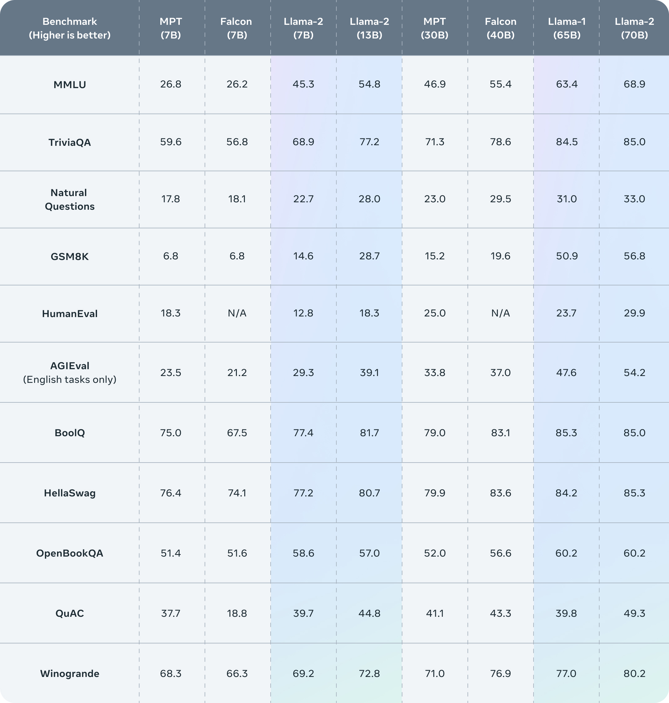

# Llama2-Chinese

## 🗂️ 内容导引
- [Llama2-Chinese](#llama2-chinese)
  - [🗂️ 内容导引](#️-内容导引)
  - [安装](#安装)
  - [⏬ 模型部署](#-模型部署)
    - [模型下载](#模型下载)
      - [基于Llama2的中文微调模型](#基于llama2的中文微调模型)
      - [基于Llama2的中文预训练模型Atom](#基于llama2的中文预训练模型atom)
    - [模型调用代码示例](#模型调用代码示例)
  - [💡 模型微调](#-模型微调)
    - [微调过程](#微调过程)
      - [Step1: 环境准备](#step1-环境准备)
      - [Step2: 数据准备](#step2-数据准备)
      - [Step3: 微调脚本](#step3-微调脚本)
    - [加载微调模型](#加载微调模型)
  - [💪 外延能力](#-外延能力)
    - [LangChain](#langchain)
  - [📖 学习资料](#-学习资料)
    - [Llama相关论文](#llama相关论文)
    - [Llama2的评测结果](#llama2的评测结果)
  - [参考](#参考)

## 安装

```shell
python -m venv env
source env/bin/activate
which python
pip install --upgrade pip
pip install torch transformers sentencepiece protobuf accelerate gradio bitsandbytes scipy -i https://pypi.tuna.tsinghua.edu.cn/simple
pip install -r requirements.txt -i https://pypi.tuna.tsinghua.edu.cn/simple
```

## ⏬ 模型部署

### 模型下载

#### 基于Llama2的中文微调模型

|  类别  | 模型名称   | 🤗模型加载名称             | 基础模型版本 |    下载地址                                                     |
|  ----------  | ---------- | ------------- |  ----------------- | ------------------- |
|  合并参数 | Llama2-Chinese-7b-Chat | FlagAlpha/Llama2-Chinese-7b-Chat  |    meta-llama/Llama-2-7b-chat-hf       |[模型下载](https://huggingface.co/FlagAlpha/Llama2-Chinese-7b-Chat)  |
|  合并参数 | Llama2-Chinese-13b-Chat | FlagAlpha/Llama2-Chinese-13b-Chat|     meta-llama/Llama-2-13b-chat-hf     |[模型下载](https://huggingface.co/FlagAlpha/Llama2-Chinese-13b-Chat) |
|  LoRA参数 | Llama2-Chinese-7b-Chat-LoRA  | FlagAlpha/Llama2-Chinese-7b-Chat-LoRA  |     meta-llama/Llama-2-7b-chat-hf      |[模型下载](https://huggingface.co/FlagAlpha/Llama2-Chinese-7b-Chat-LoRA) |
|  LoRA参数 | Llama2-Chinese-13b-Chat-LoRA | FlagAlpha/Llama2-Chinese-13b-Chat-LoRA |     meta-llama/Llama-2-13b-chat-hf     |[模型下载](https://huggingface.co/FlagAlpha/Llama2-Chinese-13b-Chat-LoRA) |


#### 基于Llama2的中文预训练模型Atom

| 模型名称        | 🤗模型加载名称                  | 下载地址                                                     |
| --------------- | ------------------------------ | ------------------------------------------------------------ |
| Atom-7B  | FlagAlpha/Atom-7B  | [模型下载](https://huggingface.co/FlagAlpha/Atom-7B) |


### 模型调用代码示例

1. [get_start.py](get_start.py)

## 💡 模型微调

### 微调过程

#### Step1: 环境准备

根据[requirements.txt](https://github.com/FlagAlpha/Llama2-Chinese/blob/main/requirements.txt)安装对应的环境依赖。

#### Step2: 数据准备
在data目录下提供了一份用于模型sft的数据样例：
- 训练数据：[data/train_sft.csv](https://github.com/FlagAlpha/Llama2-Chinese/blob/main/data/train_sft.csv)
- 验证数据：[data/dev_sft.csv](https://github.com/FlagAlpha/Llama2-Chinese/blob/main/data/dev_sft.csv)

每个csv文件中包含一列“text”，每一行为一个训练样例，每个训练样例按照以下格式将问题和答案组织为模型输入，您可以按照以下格式自定义训练和验证数据集：
```
"<s>Human: "+问题+"\n</s><s>Assistant: "+答案
```
例如，
```
<s>Human: 用一句话描述地球为什么是独一无二的。</s><s>Assistant: 因为地球是目前为止唯一已知存在生命的行星。</s>
```

#### Step3: 微调脚本

我们提供了用于微调的脚本[train/sft/finetune.sh](https://github.com/FlagAlpha/Llama2-Chinese/blob/main/train/sft/finetune.sh)，通过修改脚本的部分参数实现模型的微调，关于微调的具体代码见[train/sft/finetune_clm_lora.py](https://github.com/FlagAlpha/Llama2-Chinese/blob/main/train/sft/finetune_clm_lora.py)，单机多卡的微调可以通过修改脚本中的`--include localhost:0`来实现。


### 加载微调模型
微调模型参数见：[基于Llama2的中文微调模型](#基于llama2的中文微调模型)，LoRA参数需要和基础模型参数结合使用。

通过[PEFT](https://github.com/huggingface/peft)加载预训练模型参数和微调模型参数，以下示例代码中，base_model_name_or_path为预训练模型参数保存路径，finetune_model_path为微调模型参数保存路径。

```python
import torch
from transformers import AutoTokenizer, AutoModelForCausalLM
from peft import PeftModel,PeftConfig
# 例如: finetune_model_path='FlagAlpha/Llama2-Chinese-7b-Chat-LoRA'
finetune_model_path=''  
config = PeftConfig.from_pretrained(finetune_model_path)
# 例如: base_model_name_or_path='meta-llama/Llama-2-7b-chat'
tokenizer = AutoTokenizer.from_pretrained(config.base_model_name_or_path,use_fast=False)
tokenizer.pad_token = tokenizer.eos_token
model = AutoModelForCausalLM.from_pretrained(config.base_model_name_or_path,device_map='auto',torch_dtype=torch.float16,load_in_8bit=True)
model = PeftModel.from_pretrained(model, finetune_model_path, device_map={"": 0})
model =model.eval()
input_ids = tokenizer(['<s>Human: 介绍一下北京\n</s><s>Assistant: '], return_tensors="pt",add_special_tokens=False).input_ids.to('cuda')        
generate_input = {
    "input_ids":input_ids,
    "max_new_tokens":512,
    "do_sample":True,
    "top_k":50,
    "top_p":0.95,
    "temperature":0.3,
    "repetition_penalty":1.3,
    "eos_token_id":tokenizer.eos_token_id,
    "bos_token_id":tokenizer.bos_token_id,
    "pad_token_id":tokenizer.pad_token_id
}
generate_ids  = model.generate(**generate_input)
text = tokenizer.decode(generate_ids[0])
print(text)
```

## 💪 外延能力

除了持续增强大模型内在的知识储备、通用理解、逻辑推理和想象能力等，未来，我们也会不断丰富大模型的外延能力，例如知识库检索、计算工具、WolframAlpha、操作软件等。
我们首先集成了LangChain框架，可以更方便地基于Llama2开发文档检索、问答机器人和智能体应用等，关于LangChain的更多介绍参见[LangChain](https://github.com/langchain-ai/langchain)。
### LangChain
针对LangChain框架封装的Llama2 LLM类见[examples/llama2_for_langchain.py](https://github.com/FlagAlpha/Llama2-Chinese/blob/main/examples/llama2_for_langchain.py)，简单的调用代码示例如下：
```python
from llama2_for_langchain import Llama2

# 这里以调用4bit量化压缩的Llama2-Chinese参数FlagAlpha/Llama2-Chinese-13b-Chat-4bit为例
llm = Llama2(model_name_or_path='FlagAlpha/Llama2-Chinese-13b-Chat-4bit', bit4=True)

while True:
    human_input = input("Human: ")
    response = llm(human_input)
    print(f"Llama2: {response}")
```

## 📖 学习资料  

### Llama相关论文
* [LLaMA: Open and Efficient Foundation Language Models](https://arxiv.org/abs/2302.13971)
* [Llama 2: Open Foundation and Fine-Tuned Chat Models](https://arxiv.org/abs/2307.09288)
### Llama2的评测结果
<p align="center" width="100%">

</p>

## 参考

[1] Llama2-Chinese: [FlagAlpha/Llama2-Chinese](https://github.com/FlagAlpha/Llama2-Chinese), [Llama 中文社区](https://llama.family/), [飞书知识库文档](https://chinesellama.feishu.cn/wiki/space/7257824476874768388?ccm_open_type=lark_wiki_spaceLink)

[2] [Wikipedia](https://github.com/goldsmith/Wikipedia)

[3] [悟道](https://github.com/BAAI-WuDao/Model)

[4] [Clue](https://github.com/CLUEbenchmark/CLUEDatasetSearch)

[5] [MNBVC](https://github.com/esbatmop/MNBVC)

[6] [Error：AutoTokenizer.from_pretrained，UnboundLocalError: local variable 'sentencepiece_model_pb2' referenced before assignment](https://github.com/huggingface/transformers/issues/25848)

[7] [Loading Flan-T5 tokenizer throwing UnboundLocalError for variable sentencepiece_model_pb2](https://github.com/huggingface/transformers/issues/25667)

[8] [Offline mode](https://huggingface.co/docs/transformers/installation#offline-mode)